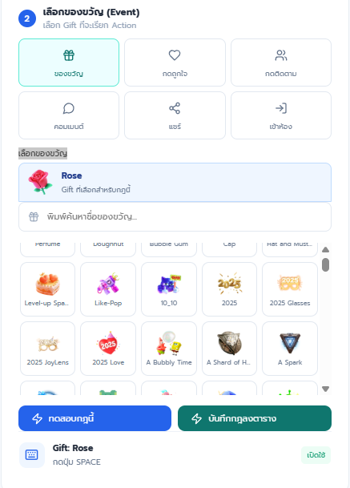
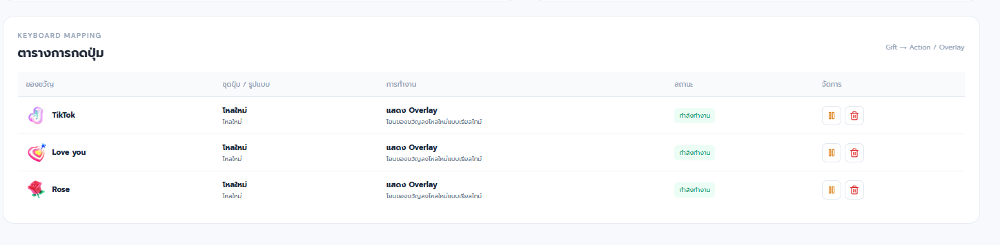
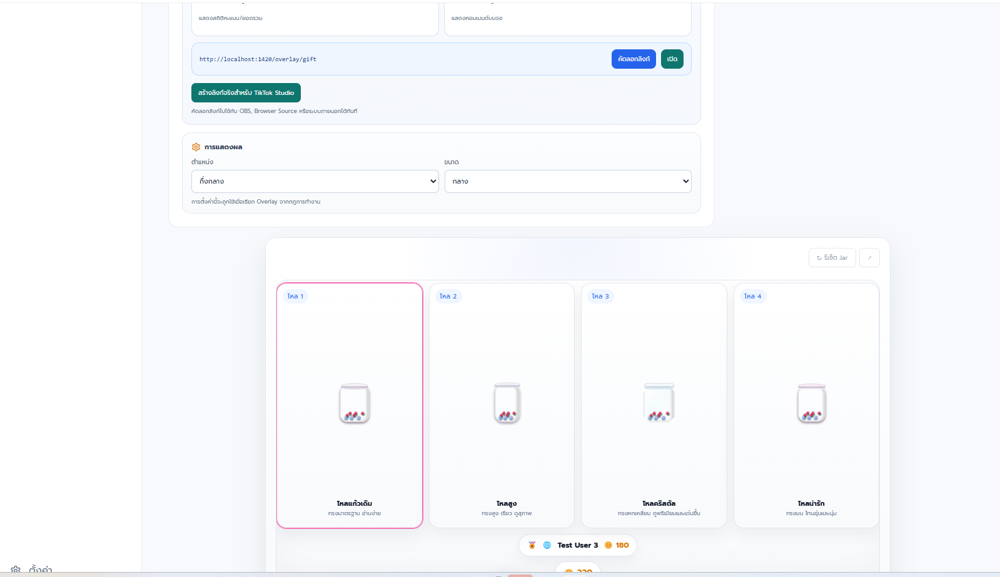
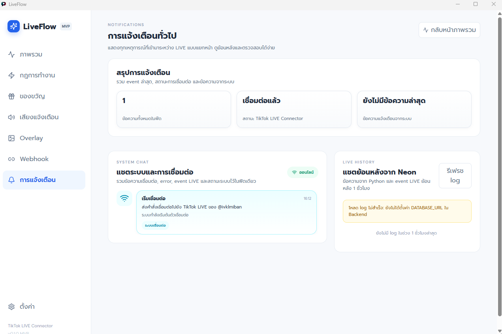

# LiveFlow

LiveFlow เป็นโปรแกรม Windows สำหรับเชื่อม TikTok LIVE กับกฎอัตโนมัติ เช่น กดปุ่มคีย์บอร์ด เล่นเสียง แสดง Overlay และส่ง Webhook พร้อมหน้าติดตามแชตและกิจกรรมแบบเรียลไทม์

> TikTokLive เป็นไลบรารี third-party ที่ไม่ได้เป็น API ทางการของ TikTok การเปลี่ยนแปลงฝั่ง TikTok อาจทำให้การเชื่อมต่อหยุดทำงานชั่วคราวได้

## ดาวน์โหลดและติดตั้ง

เปิดหน้า [Releases](https://github.com/boonanannamna/LiveFlow/releases/latest) แล้วดาวน์โหลดไฟล์:

**`LiveFlow_0.1.8_x64-setup.exe`**

ไฟล์นี้คือตัวติดตั้งสำหรับ Windows 64-bit และรวม TikTok LIVE connector ไว้แล้ว เครื่องผู้ใช้ไม่ต้องติดตั้ง Python แยก

ไฟล์อื่นใน Release:

| ไฟล์ | ใช้ทำอะไร |
|---|---|
| `LiveFlow_0.1.8_x64-setup.exe` | ไฟล์ที่ผู้ใช้ต้องดาวน์โหลดและเปิดติดตั้ง |
| `LiveFlow_0.1.8_x64-setup.exe.sig` | ลายเซ็นสำหรับระบบอัปเดต ไม่ต้องเปิดเอง |
| `latest.json` | ข้อมูลเวอร์ชันสำหรับระบบอัปเดต ไม่ต้องเปิดเอง |

วิธีติดตั้ง:

1. ดาวน์โหลดไฟล์ `.exe` จากส่วน **Assets** ของ Release ล่าสุด
2. ปิด LiveFlow เวอร์ชันเดิมก่อนติดตั้ง เพื่อไม่ให้ไฟล์ connector ถูกล็อก
3. ดับเบิลคลิกไฟล์ติดตั้ง แล้วดำเนินการตามหน้าจอ
4. เปิด LiveFlow จากไอคอนบน Desktop หรือเมนู Start
5. สมัครสมาชิกหรือเข้าสู่ระบบ แล้วกรอก TikTok username โดยไม่จำเป็นต้องใส่ `@`

หาก Windows SmartScreen แจ้งเตือน ให้ตรวจว่าดาวน์โหลดจาก repository นี้ แล้วเลือก **More info → Run anyway**

## เริ่มใช้งาน TikTok LIVE

1. ให้บัญชี TikTok เป้าหมายกำลัง LIVE อยู่
2. เปิดหน้า **ภาพรวม** และกรอก username เช่น `ivklmiban`
3. กด **เชื่อมต่อ LIVE** และรอไฟสถานะเปลี่ยนเป็น Online
4. เปิดหน้า **การแจ้งเตือน** เพื่อตรวจสถานะ connector, แชต และ event ที่เข้ามา
5. สร้างกฎในหน้า **กฎการทำงาน** แล้วกดทดสอบก่อนใช้งานจริง

โปรแกรมรองรับ Event หลัก: ของขวัญ, ถูกใจ, ติดตาม, คอมเมนต์, แชร์ และเข้าห้อง การทำงานจริงขึ้นอยู่กับ event ที่ TikTok ส่งให้ connector ในขณะนั้น

## สร้างกฎการทำงาน

เลือก Event และ Gift แล้วเลือก Action ที่ต้องการ สามารถกำหนดชุดปุ่มหลายปุ่ม ทดสอบ หยุดชั่วคราว เปิดใช้งานต่อ หรือลบกฎได้



กฎที่บันทึกแล้วจะแสดงในตาราง **KEYBOARD MAPPING** เพื่อให้ตรวจสอบ Gift → Action และสถานะได้จากจุดเดียว



คำแนะนำ:

- ทดสอบกฎด้วยปุ่ม ▶ ก่อนเริ่ม LIVE จริง
- การกดคีย์บอร์ดต้องเปิดผ่าน Tauri Desktop ไม่ใช่หน้า preview ในเว็บ
- เปิดโปรแกรมหรือเกมปลายทางไว้ และตรวจว่าปุ่มที่เลือกไม่ชนกับ shortcut ของ Windows
- ถ้ากฎถูกพัก ให้กดเปิดใช้งานต่อก่อนรับ Event

## Overlay สำหรับ TikTok Studio หรือ OBS

หน้า **Overlay** ใช้ตั้งค่าโหลสะสม Gift, ภาพ, วิดีโอ หรือข้อความแจ้งเตือน สามารถเลือก Gift จากกฎ ปรับจำนวนสูงสุด ขนาดลูกบอล การแสดงชื่อ/Coins และรูปแบบแอนิเมชัน



วิธีใช้งาน:

1. สร้างและบันทึกกฎ Gift ที่หน้า **กฎการทำงาน**
2. เปิดหน้า **Overlay** แล้วเลือกรูปแบบที่ต้องการ
3. กดทดสอบเพื่อดูผลในหน้าพรีวิว
4. กด **สร้างลิงก์จริงสำหรับ TikTok Studio**
5. คัดลอก URL ที่ได้ไปเพิ่มเป็น Browser Source ใน TikTok Studio หรือ OBS
6. เปิด LiveFlow และ connector ค้างไว้ระหว่าง LIVE เพราะ Overlay รับ state จาก backend เดียวกับ Event จริง

ลิงก์ `trycloudflare.com` เป็น Quick Tunnel ชั่วคราว ถ้าปิดโปรแกรมหรือ `cloudflared` ลิงก์จะหยุดทำงานและอาจต้องสร้างใหม่

## แชตสดและการแจ้งเตือน

หน้า **การแจ้งเตือน** แสดงขั้นตอนเชื่อมต่อ สถานะ connector ข้อผิดพลาด แชต TikTok LIVE และกิจกรรมล่าสุดแบบเรียลไทม์ ใช้ตรวจว่าระบบรับ event เข้ามาจริงหรือไม่



สถานะหลัก:

- **Online**: connector เชื่อมต่อและพร้อมรับ event
- **Connecting**: กำลังค้นหาห้อง LIVE หรือเชื่อม WebSocket
- **No chat**: เชื่อมต่อแล้วแต่ยังไม่มีคอมเมนต์เข้ามา
- **Error**: เชื่อมต่อไม่สำเร็จ ให้ตรวจ username, สถานะ LIVE และอินเทอร์เน็ต

## เสียงและ Webhook

- **เสียงแจ้งเตือน**: เลือกเสียงตัวอย่างหรือเพิ่มไฟล์เสียงของผู้ใช้ แล้วผูกกับ Event
- **Webhook**: ส่ง HTTP request ไปยังบริการภายนอกเมื่อกฎทำงาน ควรใช้ URL แบบ HTTPS และทดสอบก่อน LIVE
- ข้อมูลสำคัญ เช่น token หรือรหัสผ่าน ไม่ควรใส่ไว้ใน URL ที่เผยแพร่สาธารณะ

## ระบบอัปเดตอัตโนมัติ

LiveFlow ตรวจสอบ Release ล่าสุดจาก GitHub ตอนเปิดโปรแกรม หากพบเวอร์ชันใหม่ โปรแกรมจะดาวน์โหลด ตรวจลายเซ็น ติดตั้ง และเปิดใหม่ก่อนเข้าใช้งาน

เครื่องที่ใช้รุ่นเก่ากว่า `0.1.8` ต้องติดตั้ง `0.1.8` ด้วยตัวเองหนึ่งครั้ง หลังจากนั้นจึงรองรับอัปเดตอัตโนมัติ

## แก้ปัญหาเบื้องต้น

### เชื่อมต่อ LIVE ไม่ได้

- ตรวจว่า username ถูกต้องและบัญชีกำลัง LIVE
- ไม่ต้องใส่ URL โปรไฟล์ ให้ใส่เฉพาะ username
- ปิดแล้วเปิด LiveFlow ใหม่ และดูรายละเอียดในหน้า **การแจ้งเตือน**
- Firewall หรือ Antivirus ต้องอนุญาต `LiveFlow.exe` และ `liveflow-tiktok-connector.exe`

### ติดตั้งทับไม่ได้

ปิด LiveFlow และหน้าต่าง connector ทั้งหมดก่อนกด Retry หากยังไม่ได้ให้รีสตาร์ต Windows แล้วติดตั้งอีกครั้ง

### Overlay ขึ้น 502/1033

Quick Tunnel ไม่ทำงานหรือแอปถูกปิด ให้เปิด LiveFlow ใหม่แล้วสร้างลิงก์ Overlay ใหม่

### กดคีย์บอร์ดไม่ทำงาน

ใช้ Tauri Desktop, เปิดใช้งานกฎ, ทดสอบด้วยปุ่ม ▶ และให้หน้าต่างโปรแกรมปลายทางพร้อมรับปุ่ม หากเกมเปิดแบบ Administrator อาจต้องเปิด LiveFlow ด้วยสิทธิ์ระดับเดียวกัน

## สำหรับนักพัฒนา

Stack: React + TypeScript + Vite + Tauri 2/Rust + Neon PostgreSQL + TikTokLive Python sidecar

```powershell
npm install
npm run tauri:dev
```

ห้าม commit `.env`, private signing key, database password, SMTP password หรือ API token ขึ้น repository

รายละเอียดการออกเวอร์ชันอยู่ใน [GITHUB-UPDATE-SETUP.md](GITHUB-UPDATE-SETUP.md)
